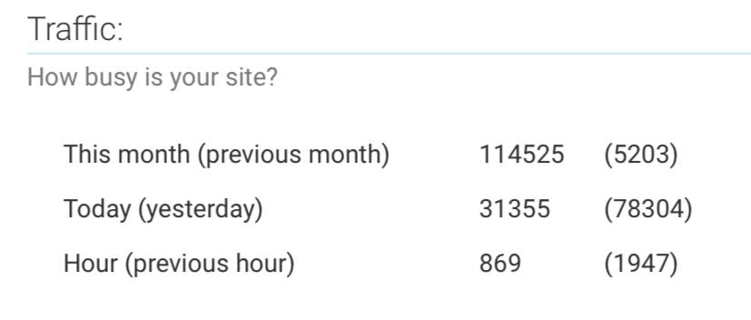
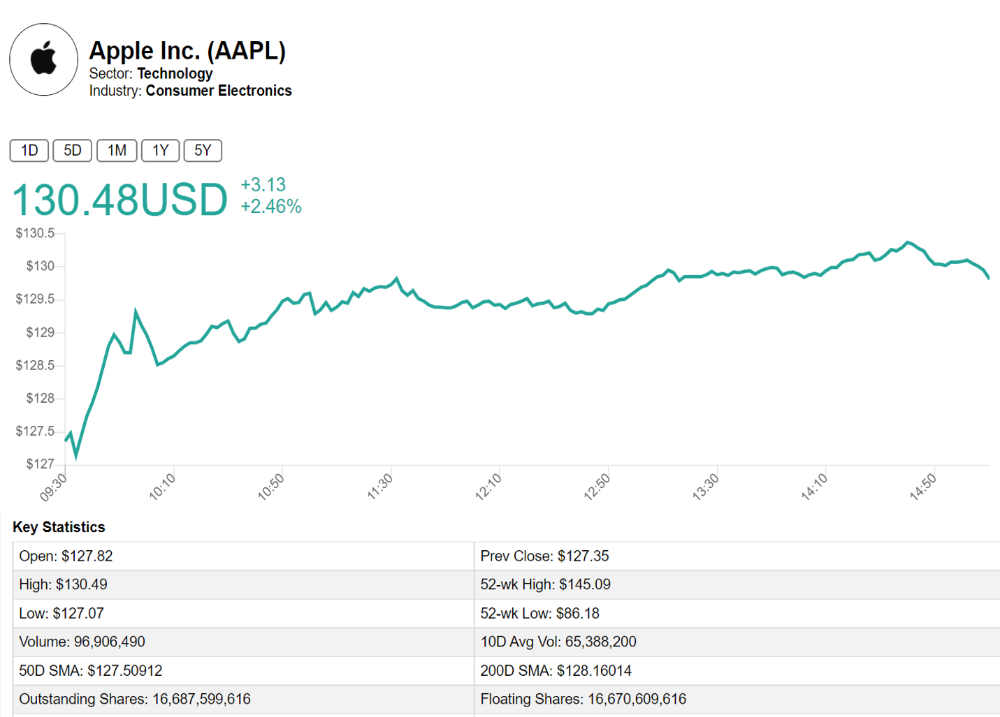
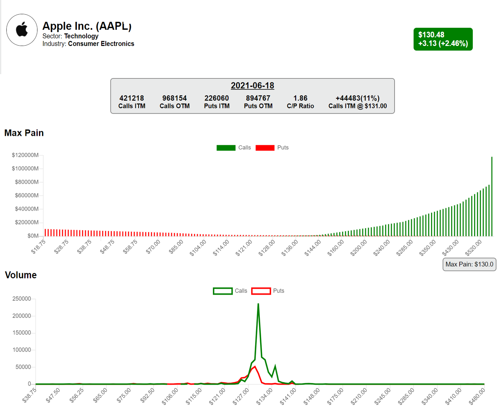
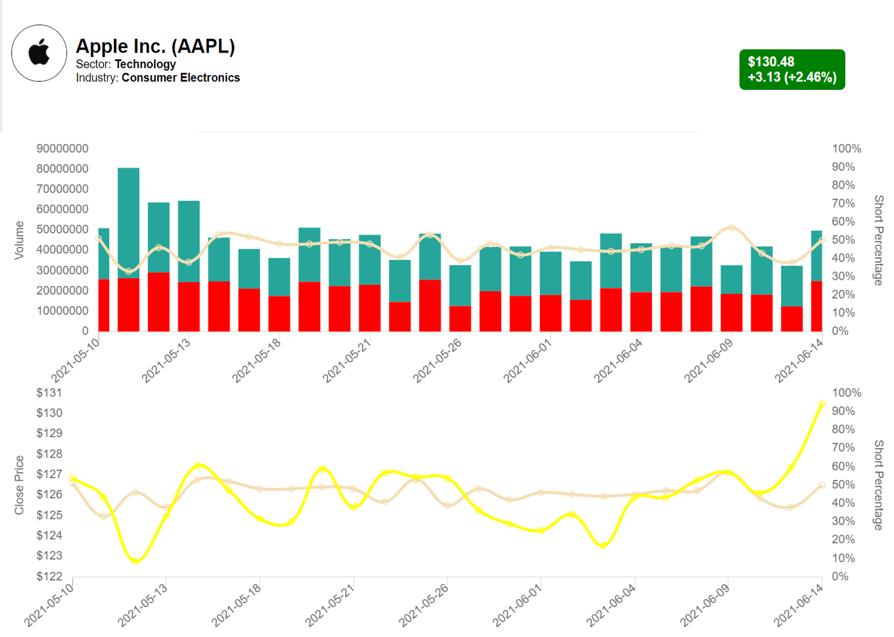
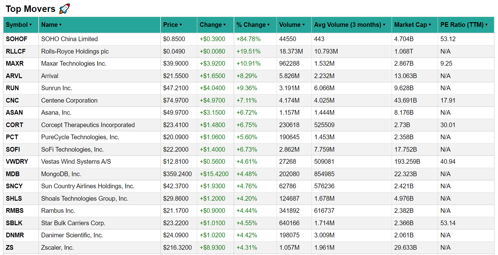
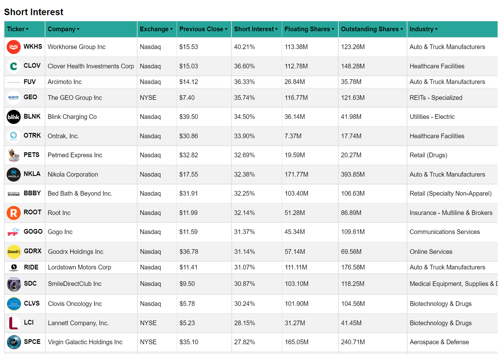

# StocksEra

You can view the application in:
- <a href="https://stocksera.pythonanywhere.com">stocksera.pythonanywhere.com </a>
- <a href="https://stockserabeta.pythonanywhere.com">StockseraBeta.pythonanywhere.com </a>

Both websites are exactly the same. But because I'm hosting it free on pythonanywhere, speed of website can be (very) slow when traffic is high. 



Please use the other website if the one you are using is slow. Alternatively, you can host it locally on your computer, where the speed is much faster.

### Support:
This website will be free forever! No subscription needed! But if you want to support me, please give me a star on Github or you can PayPal to <a href="https://www.paypal.me/stocksera">paypal.me/stocksera</a>

### User Guide:

#### /ticker/
- View graph/historical data of your favourite ticker.
- Gather key statistics such as EPS, beta and SMA.
- Proportion of stocks held by major holders and major institutions.
- Google trending.
- Data is from <a href="https://finance.yahoo.com/">yahoo finance</a>


#### /ticker/options/
- View options chain of your favourite ticker. Inspired from <a href="https://github.com/GamestonkTerminal/GamestonkTerminal/tree/main/gamestonk_terminal">Gamestonk Terminal</a>
- Find out the max-pain price, OTM & ITM options and Call/Put ratio of the next few weeks.
- NOTE: Options chain and max-pain price are updated real time. Hence, there may be a slight delay in rendering this page. 
- Data is from <a href="https://finance.yahoo.com/">yahoo finance</a>


#### /ticker/short_volume/
- View short volume and short percentage of some of the popular tickers.
- Data is from <a href="http://shortvolumes.com/">shortvolumes.com</a>


#### /ticker/failure_to_deliver/
- View failure to deliver data of some of the popular tickers.
- Data is from <a href="https://www.sec.gov/data/foiadocsfailsdatahtm">SEC.gov</a>


#### /earnings_calendar/
- View all tickers earnings report for the week ahead 
- Market Cap, EPS Estimate and EPS Actual
- Sortable by market cap and day
- Data is from <a href="https://finance.yahoo.com/">yahoo finance</a>


#### /reddit_analysis/
- Find the most mentioned tickers with their sentiment level on different subreddits such as r/wallstreetbets, r/stockmarket and r/stocks. Inspired from <a href="https://github.com/kaito1410/AutoDD_Rev2/blob/main/AutoDD.py">Auto DD</a>
- Data is updated daily, around 1 hour before market open.


#### /reddit_etf/
- Analyse the performance of trending tickers on r/wallstreetbets.
- Top 10 most mentioned tickers with the highest sentiment will be added to the "Reddit ETF" when market opens.
- Tickers that fall outside the Top 10 list will be sold.


#### /subreddit_count/
- Look at the increase in number of redditors on popular sub-reddits such as r/wallstreetbets, r/Superstonk and r/amcstock.
- Growth in number of new redditors and percentage of active redditors.
- This page is currently very basic, open to new suggestions on how to improve this page.


#### /due_diligence/
- Note: This page is still in development
- A compilation of top due-diligence on Reddit. 
- Data is manually sourced by Stocksera on a regular basis.

#### /top_movers/
- Identify top gainers and losers during market hours.


#### /short_interest/
- Identify tickers with the highest short interest level.


#### /low_float/
- Identify tickers with low float.


#### /ark_trades/
- View holdings, trades and news of all companies in ARK Fund.
- View trades and ownership of a ticker.
- Data is from <a href="https://arkfunds.io/api/">arkfunds.io/api</a>


#### /latest_news/
- View latest news of your favorite ticker
- Get their overall news sentiment and their sentiment level over time
- Compare the sentiment level with other popular tickers such as GME, AAPL, TSLA.
- NOTE: This feature is not available on pythonanywhere. To use this feature, you have to host the application locally. Please refer to the Developers section for more details
- Data is from <a href="https://finviz.com/">finviz</a>


### For developers:
- Advantages of hosting it locally on your computer:
    - Faster rendering time
    - Customise your own ticker
    - Access to news sentiment

#### Setting up and installing dependencies
```
# Clone the project
git clone https://github.com/spartan737/Stocksera.git

# Create environment
py -m venv venv

# Navigate into project's folder
cd Stockera

# Install modules
pip install -r requiresments.txt

# Set up static file
py manage.py collectstatic
```

Download nltk data for sentiment analysis. Type the following in console:
```
>>> import ntlk
>>> nltk.download("vader_lexicon")
```

#### Sign up credentials for Reddit API
- Register for an API in <a href="https://www.reddit.com/prefs/apps">https://www.reddit.com/prefs/apps </a> and enter credential in scheduled_tasks/config.py


#### Setting up SQLite database (file found in scheduled_tasks folder)
```
cd scheduled_tasks
py create_database.py
```

#### Run scheduled tasks
- Please refer to [Scheduled Tasks Guide](https://github.com/spartan737/Stocksera/tree/master/scheduled_tasks) for more information on how to run scheduled tasks.

#### Setting up news sentiment
- Go to ViewStocks/urls.py and uncomment 'sub_news/' and 'latest_news/'.
- Go to templates/format.html and uncomment line 33.
- Go to templates/ticker_price.html and uncomment line 92-95.

#### Running the application
```
# Run application (view it in 127.0.0.1:8000):
py manange.py runserver
# And you're ready to explore!
```

### Future improvements:
- [ ] Improve speed of website (although I feel that the major issue lies with pythonanywhere-the website I'm hosting instead)
- [ ] Income Statement and Cash Flow for Financial data
- [ ] Show theta, delta, gamma in Options data
- [ ] Show performance of Reddit ETF vs SPY
- [ ] Show hedge funds (Citadel, Melvin Capital etc) major holdings
- [ ] Show T-35 date in FTD data

### Review and Showcase:


### License:
This project is under the <a href="https://github.com/spartan737/stocksera/blob/master/LICENSE">MIT</a> license.