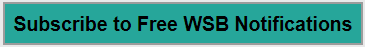
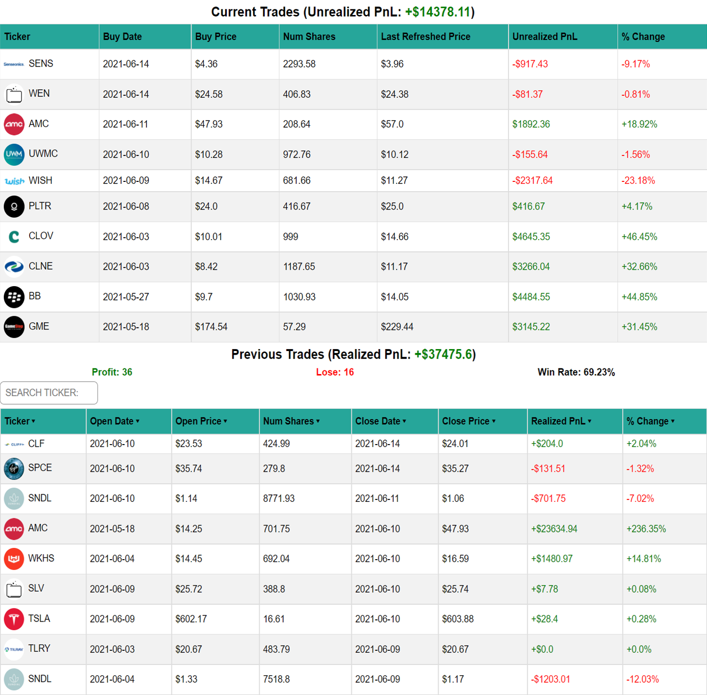
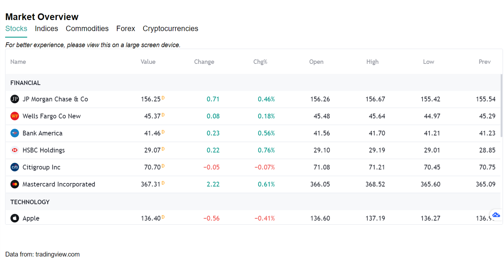
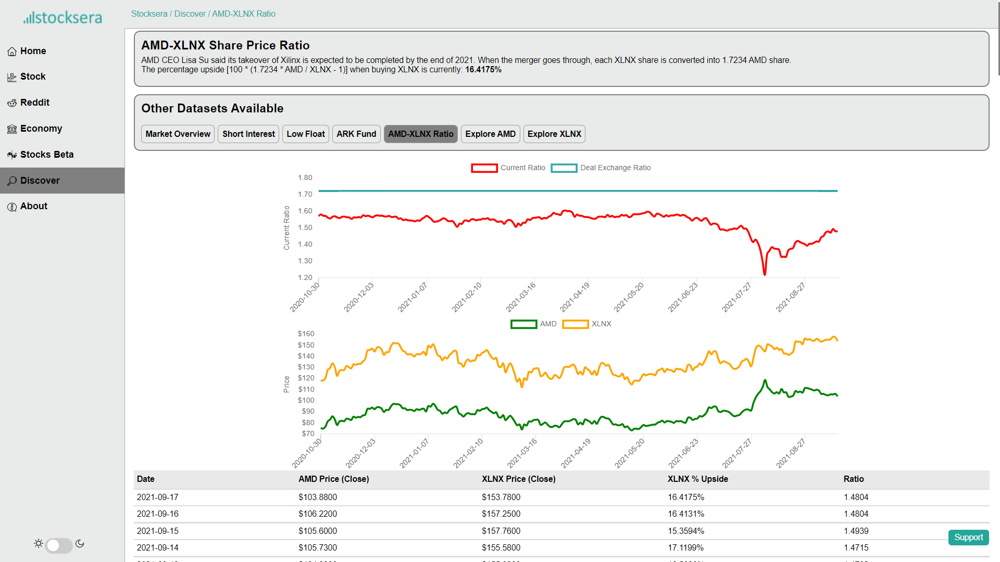

# StocksEra


You can view the application in <a href="https://stocksera.pythonanywhere.com" target="_blank">stocksera.pythonanywhere.com</a>.

<a href="https://stocksera.pythonanywhere.com/subscribe/" target="_blank"></a>

Live demo is available at https://youtu.be/jkAZu7DvhvY.

### Support:
This website is free for everyone. But if you want to support me, please give me a star on Github or you can PayPal to <a href="https://www.paypal.me/stocksera">paypal.me/stocksera</a>. Patreon is also available <a href="https://www.patreon.com/stocksera" target="_blank">here</a>.

### User Guide:

#### /ticker/
- View graph of your favourite ticker.
- Gather key statistics such as EPS, beta and SMA.
- Data is from <a href="https://finance.yahoo.com/">yahoo finance</a>


- Sort historical data based on % price change, volume, day and so on.


- Get recent insider trading of a stock.


- Get recent news and sentiment of a stock.


- Google trend of a stock and compare it with it's closing price.


- Upgrades & Downgrades of a stock.


- Links to other social media platforms for discussion.
- Stocktwits API.


#### /ticker/options/
- View options chain of your favourite ticker. Inspired from <a href="https://github.com/GamestonkTerminal/GamestonkTerminal/tree/main/gamestonk_terminal">Gamestonk Terminal</a>.
- Find out the max-pain price, OTM & ITM options and Call/Put ratio of the next few weeks.
- Data is from <a href="https://finance.yahoo.com/">yahoo finance</a>.


#### /ticker/short_volume/
- View short volume and short percentage of some of the popular tickers.
- Data is from <a href="https://cdn.finra.org/">Finra</a>.


#### /ticker/failure_to_deliver/
- View failure to deliver data of some of the popular tickers.
- Data is from <a href="https://www.sec.gov/data/foiadocsfailsdatahtm">SEC.gov</a>.


#### /earnings_calendar/
- View all tickers earnings report for the week ahead.
- Market Cap, EPS Estimate and EPS Actual.
- Sortable by market cap and day.
- Data is from <a href="https://finance.yahoo.com/">yahoo finance</a>.


#### /reddit_analysis/
- Find the most popular tickers with their sentiment level on different subreddits such as r/wallstreetbets, r/stockmarket and r/stocks. Inspired from <a href="https://github.com/kaito1410/AutoDD_Rev2/blob/main/AutoDD.py">Auto DD</a>.
- Trending cryptocurrencies are also analysed in r/Cryptocurrency.
- This only reads the post of the subreddit. The comments are not taken into account. 
- Data is updated daily, around 1 hour before market open.


#### /wsb_live/
- Tracks trending tickers and their sentiment level on r/wallstreetbets realtime.
- STILL IN PROGRESS

#### /reddit_etf/
- Analyse the performance of trending tickers on r/wallstreetbets.
- Top 10 most mentioned tickers with the highest sentiment will be added to the "Reddit ETF" when market opens.
- Tickers that fall outside the Top 10 list will be sold.


#### /reddit_ticker_analysis/
- View ranking of popular tickers in Reddit over time and compare it with its price.


#### /subreddit_count/
- Look at the increase in number of redditors on popular subreddits such as r/wallstreetbets, r/Superstonk and r/amcstock.
- Growth in number of new redditors and percentage of active redditors.


#### /subreddit_count/?quote={{ticker}}
- Look at the increase in number of redditors/active users/percentage growth on specific subreddits and compare it with the stock price.


#### /market_overview/
- Overview of the performance of the entire market.
- Data is from <a href="https://tradingview.com/">Trading View</a>.


#### /short_interest/
- Identify tickers with the highest short interest level.
- Data is from <a href="https://www.highshortinterest.com">shortinterest.com</a>


#### /low_float/
- Identify tickers with low float.
- Data is from <a href="https://www.lowfloat.com">lowfloat.com</a>


#### /ark_trades/
- View holdings, trades and news of all companies in ARK Fund.
- View trades and ownership of a ticker.
- Data is from <a href="https://arkfunds.io/api/">arkfunds.io/api</a>


#### /reverse_repo/
- Daily reverse repo transactions (amount, number of parties, average)
- Data is from <a href="https://apps.newyorkfed.org/markets/autorates/tomo-search-page">newyorkfed</a>


#### /daily_treasury/
- Daily treasury (closing balance, opening balance)
- Data is from <a href="https://fiscaldata.treasury.gov/datasets/daily-treasury-statement/operating-cash-balance">fiscaldata.treasury.gov</a>


#### /inflation/
- Monthly inflation rate (with heat map) from 2001
- Data is from <a href="https://www.usinflationcalculator.com/inflation/current-inflation-rates/">usinflationcalculator.com/inflation</a>


#### /retail_sales/
- Monthly retail sales and compare it with the number of covid-19 cases
- Retail sales data is from <a href="https://ycharts.com/indicators/us_retail_and_food_services_sales">ycharts.com/indicators/us_retail_and_food_services_sales</a>
- Covid-19 data is from <a href="https://covid.ourworldindata.org/data/owid-covid-data.csv">covid.ourworldindata.org/data/owid-covid-data.csv</a>


#### /beta/
- Calculate the true beta value of any stock real-time.


#### /amd_xlnx_ratio/
- AMD-XLNX Share Price Ratio.
- Percentage upside when buying XLNX


### For developers:

#### Setting up and installing dependencies
```
# Clone the project
git clone https://github.com/spartan737/Stocksera.git

# Create environment
py -m venv venv

# Navigate into project's folder and activate venv
cd Stockera/venv/Scripts
activate
cd .. / ..

# Install modules
pip install -r requirements.txt

# Set up static file (if debug is set to False in settings.py)
py manage.py collectstatic
```

Download nltk data for sentiment analysis. Type the following in console:
```
>>> import nltk
>>> nltk.download("vader_lexicon")
```

#### tasks_to_run.py
- Compilation of tasks that are needed to be completed.
- Get trending tickers in Reddit, subreddit subscribers statistics, stocks with low float and high short interest.

#### Run scheduled tasks
- Please refer to [Scheduled Tasks Guide](https://github.com/spartan737/Stocksera/tree/master/scheduled_tasks) for more information on how to run scheduled tasks.

#### Running the application
You can run run_app.bat.

Alternatively, you can run using your terminal:
```
cd venv/Scripts
activate
cd ../..
py manange.py runserver
```
You can view the application in 127.0.0.1:8000.

### License:
This project is under the <a href="https://github.com/spartan737/stocksera/blob/master/LICENSE">MIT</a> license.