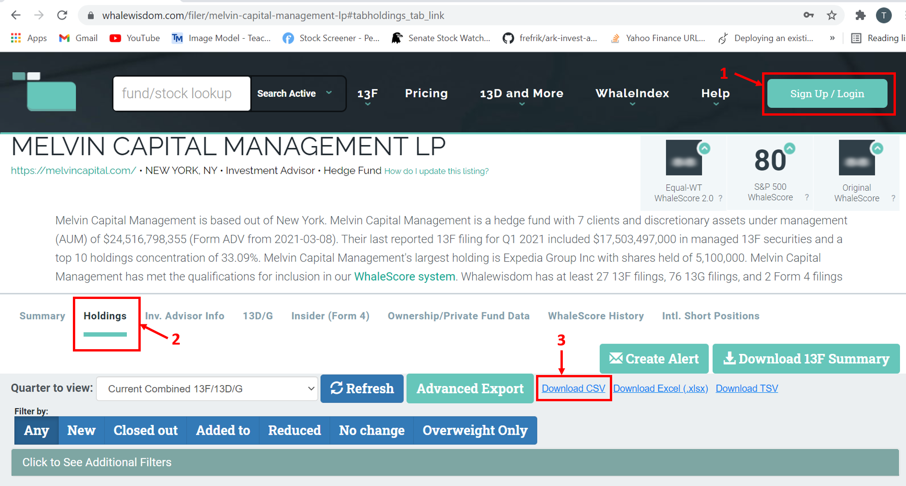

# StocksEra Developers Guide

### Scheduled Tasks to run daily

Note: Ensure that you run scheduled_tasks/create_database.py first before continuing and register for an API in <a href="https://www.reddit.com/prefs/apps">https://www.reddit.com/prefs/apps </a> and enter credential in scheduled_tasks/config.py

#### scheduled_tasks/main.py
- Compilation of tasks that are needed to be completed before market open.
- Get trending tickers in Reddit, subreddit subscribers statistics, stocks with low float and high short interest.

#### scheduled_tasks/get_reddit_trending_stocks/scrape_reddit.py
- Script to scrape trending tickers in Reddit (r/wallstreetbets, r/StockMarket, r/stocks).
- Additional information (beta, volume, industry, recommendation etc) of the ticker will be extracted from yahoo finance too.
- Edit your config in scheduled_tasks/config.py. Make sure you have you PRAW API key first.
- Extension of [https://github.com/kaito1410/AutoDD_Rev2](https://github.com/kaito1410/AutoDD_Rev2)

#### scheduled_tasks/miscellaneous.py
- Get stocks with low float and high short interest.
- Do not need to run this script daily since information is updated once every few weeks.

#### scheduled_tasks/get_short_volume.py
- Get short volume of tickers you are interested in.
- Best to run this daily to identify the trending of short volume over time.
- To add a new ticker, add it to list_of_tickers list in full_ticker_list().

#### scheduled_tasks/get_news_sentiment.py
- Get news sentiment of ticker you are interested in.
- Best to run this daily to identify the trending of news sentiment over time.
- Tickers are based on full_ticker_list() in scheduled_tasks/get_short_volume.py.

#### scheduled_tasks/buy_trending_ticker.py
- Script that buys/sells tickers based on r/wallstreetbets sentiment.
- Update prices of tickers in custom ETF.
- Best to run this script the moment market opens.

#### scheduled_tasks/get_subreddit_count.py
- Script to get total number of users and active users in popular subreddits on Reddit.
- Shows the growth in new users over time and proportion active users.

### Scheduled Tasks to run if required

#### scheduled_tasks/get_failure_to_deliver.py
- Get Failure to Deliver data from [SEC](https://www.sec.gov/data/foiadocsfailsdatahtm).
- Download the txt file. You do not need to convert it to csv. The script automatically does it for you.
- Run this script once every few weeks.

#### scheduled_tasks/get_hedge_funds_holdings.py
- Get holdings of major hedge funds
- Download csv from [whalewisdom](https://whalewisdom.com/). You need to sign up a free account to access the csv files. Data is updated quarterly.

